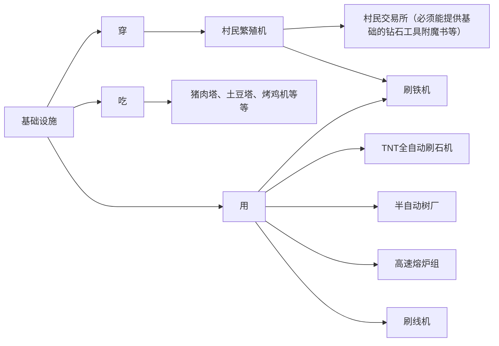

# 基地认证

为规范化服内玩家基地对新成员的招新，本服要求凡建设**10人以上**（不含10人）的基地，**必须**要申请基地认证

未经认证的玩家基地，**不准**在服内/交流群进行如下行为：

1. 一天在群里和服内发超过**5条**的招募信息。若违规将对当事人处以1-7天的封禁&禁言处罚。
2. 在出生点进行**蹲点**揽新，如放置招新告示牌等。若违规将对当事人处以1-7天的封禁&禁言处罚。
3. 不准强制玩家加入你的基地，若违规将对当事人处以1-7天的封禁&禁言处罚。
4. 基地总人数不得超过**10**（不含10）人，超过10人的基地必须申请基地认证。若违规将对基地主要负责人处以1-7天的封禁&禁言处罚。

## 认证有什么用

经过认证的基地有什么好处呢？

1. 优先进行**假人**申请审批
2. 允许在**交流群**和**服务器**的公屏内发布招新信息
3. 你的基地将优先展示在服务器后续**宣传片**中
4. 你的基地将被列入**认证基地**名单，优先展示在服务器官网上，并给予专属**定制头衔**

### 认证要求

1. **人数**：日活不得少于5人，且基地总人数应达到7~10人。

2. **基地建设**：应有一个较为完善的基地，且主要聚集地建设面积应大于1200块平方

3. **远景规划**：必须提交后续的发展规划书，如招揽新成员是为了建设什么建筑？又或是修什么大型机器如堆门猪人塔等？能确保是因基地建设需要而扩张团队，而不是单纯为了招揽新成员

4. **基础设施**：您的基地应至少包含如下机器：

> 注：以上设施仅为基础设施，如果您的基地拥有更多受到审核团队认可的设施，都将作为基地认证的加分项。
> 
> 以上提到的机器都必须是自己基地的人建造的，而不是其他玩家建造的基地，否则无效
> 
> 如您的基地偏**建筑类**而不是综合类基地，则可视情况放松对基础设施的要求