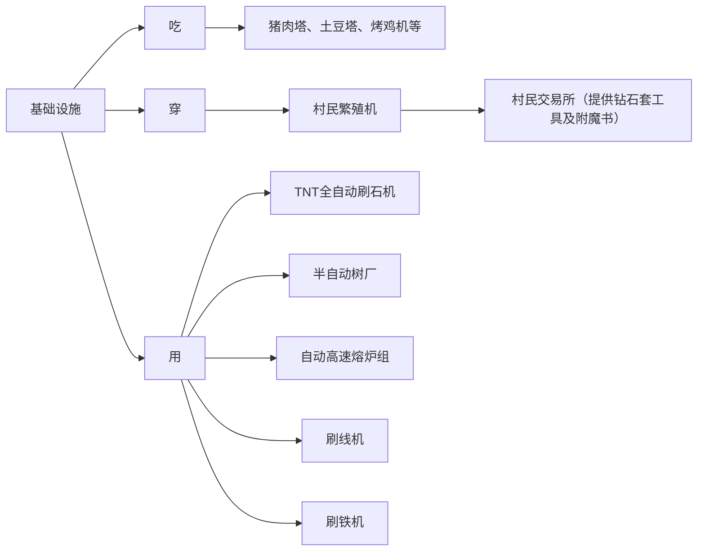
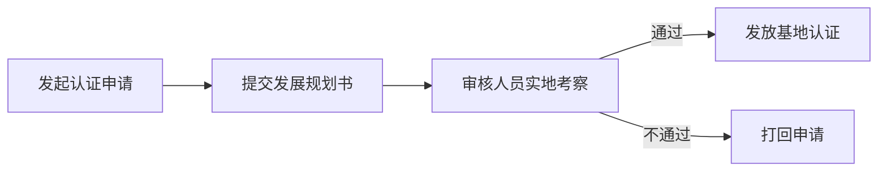

# 基地认证

为规范服内玩家基地对新成员的招新，本服要求凡建设**10人以上**（不含10人）的基地，**必须**申请基地认证。

未经认证的玩家基地，**禁止**在服内/交流群进行如下行为：

1. 一天在群里和服内发布超过**10条**招募信息。若违规将对当事人处以1-7天的封禁及禁言处罚。
2. 在出生点进行**蹲点**揽新，如放置招新告示牌等。若违规将对当事人处以1-7天的封禁及禁言处罚。
3. **强制**玩家加入基地，若违规将对当事人处以1-7天的封禁及禁言处罚。
4. 基地总人数超过**10人**（不含10人）。若违规将对基地主要负责人处以1-7天的封禁及禁言处罚。
5. 其他违反服规的行为。

:::tips

若您的玩家基地并未超过**10人**，您可自主选择是否认证基地。

:::

## 认证的好处

经过认证的基地有什么好处呢？

1. 优先进行**假人**申请审批。
2. 允许每天在**交流群**和**服务器**公屏内发布**不超过20条**招新信息。
3. 基地将优先展示在服务器后续**宣传片**中。
4. 基地将被列入**认证基地**名单，并给予专属**定制头衔**。
5. 基地**无10人**人数限制。

## 审核人员

| ID | CerealAxis41843 | JUDAJIANGUO6341 | xiaoci0awa | badmood |
| --- | --- | --- | --- | --- |
| 头像 |  |  |  |  |
| QQ号 | 2741798712 | 3204591176 | 1778617061 | 1302600482 |

## 认证要求

1. 基地负责人必须至少进服一个星期。
2. **人数**：基地日活不得少于3人，总人数应达到5~10人。如果基地非常完善，修建了很多机器，可放松对人数和日活的要求。
3. **基地建设**：应有一个较为完善的基地，主要聚集地建设面积应大于1200平方米。
4. **远景规划**：必须提交后续的发展规划书，明确招新目的，如建设建筑或大型机器（如堆门猪人塔等），确保是因基地建设需要而扩张团队。
5. **基础设施**：基地应至少包含以下机器：

> 补充说明：以上设施为基础设施。如果基地拥有更多受到审核团队认可的设施，将作为基地认证的加分项。
>
> 刷线机、高速熔炉等机器`必须`配备有`多余物品`（如线、地毯）的销毁功能，否则视为无效机器。
> 
> 以上提到的机器必须是基地成员建造，而非其他玩家建造的设施，否则无效。
> 
> 若基地偏向**建筑类**而非综合类基地，可视情况放松对基础设施的要求。

## 申请流程

:::note

为了减少工作量，基地认证的申请被打回后，有`七天`的申请冷却期，请完善好基地各项设施和准备好发展规划书后再来申请`基地认证`，避免长时间的等待。

:::

### 发展规划书要求

发展规划书需包括以下内容，字数不用太多，控制在`500字`之内，使用`docs`格式发送给审核人员：

1. **基地概况**：基地的当前状态，已有设施，成员数量及活跃情况。
2. **未来目标**：基地未来几个月的发展目标，如建筑项目、机器建设计划等。
3. **招新目的**：招揽新成员的具体原因，如为了扩建基地、增加日活、建设新设施等。
4. **实施计划**：具体的实施步骤及时间表，包括资源需求和预期完成时间。
5. **管理机制**：基地内部管理制度，成员分工及责任划分。
6. **远景展望**：基地的长远发展规划及愿景。

### 发展规划书格式示范

#### 基地概况

- 基地名称：XXX基地
- **基地坐标**：x y z
- 当前成员数：8人
- 日活人数：6人
- 已有设施：村民交易所、猪肉塔、刷铁机等

#### 未来目标

- 6个月内完成全自动熔炉系统建设
- 建设一个大型仓库及物资管理系统
- 建立一个全自动农场

#### 招新目的

- 扩建基地建筑规模
- 增加日活人数，提高基地活跃度
- 建设新的大型机器及设施

#### 实施计划

- 7月：完成熔炉系统设计并开始建设320
- 8月：招募2-3名新成员，参与仓库建设

#### 管理机制

- 基地负责人：XXX
- 成员分工：
  - 建筑组：XXX，负责基地建筑设计及建设
  - 资源组：XXX，负责资源收集及管理
  - 机器组：XXX，负责机器建设及维护

#### 远景展望

- 打造一个自给自足的大型基地，拥有完善的资源及物资管理系统
- 成为服务器内的标杆基地，吸引更多优秀玩家加入

## 标杆基地

**老登之家**：负责人 CerealAxis41843、badmood、xiaoci0awa、JUDAJIANGUO6341  

**镌松堂**:负责人 chenxi_07

### 基地对比

| 机器名称            | 镌松堂         | 老登之家         |
|-----------------|---------------|---------------|
| 刷铁机             | ✓             | ✓ （48核心）     |
| 凋零骷髅农场         | ✓             | ✓             |
| 白桦木树场          | ✓             | ✓             |
| 云杉树场           | ✓             |               |
| 全树种树场          | ✓             | ✓             |
| 守卫者农场          | ✓             | ✓             |
| 猪人塔             | ✓             | ✓             |
| 村民交易所          | ✓             | ✓             |
| 黑曜石机            | 在建          |               |
| 单区块熔炉          | ✓             | ✓             |
| 320熔炉            | ✓           | ✓             |
| 苔藓骨粉机          | ✓             | ✓             |
| 全自动物品分类机       | ✓             | ✓             |
| 袭击塔             | ✓             | ✓             |
| 沼泽刷怪塔          | ✓             | ✓             |
| 烈焰人农场          | ✓             |               |
| 全自动8核农田        | ✓             |               |
| 村民繁殖机          | ✓             | ✓             |
| 刷地毯铁轨机        | ✓             | ✓             |
| 甘蔗竹子机          | ✓             | ✓             |
| 石材工厂            | ✓             |               |
| 刷石机             | ✓             | ✓             |
| 仙人掌农场          | ✓             | ✓             |
| 潜影贝农场          | ✓             | ✓             |
| 猪灵交易所          | ✓             | ✓             |
| 刷沙固化一体机       |               | ✓             |
| 不祥之瓶农场         |               | ✓             |
| 刷玄武岩机          |               | ✓             |
| 海泡菜机           |               | ✓             |
| 刷雪块机           |               | ✓             |
| 刷可可豆机          |               | ✓             |
| 猪肉塔             |               | ✓             |
| 蛙鸣灯农场         |               | ✓             |